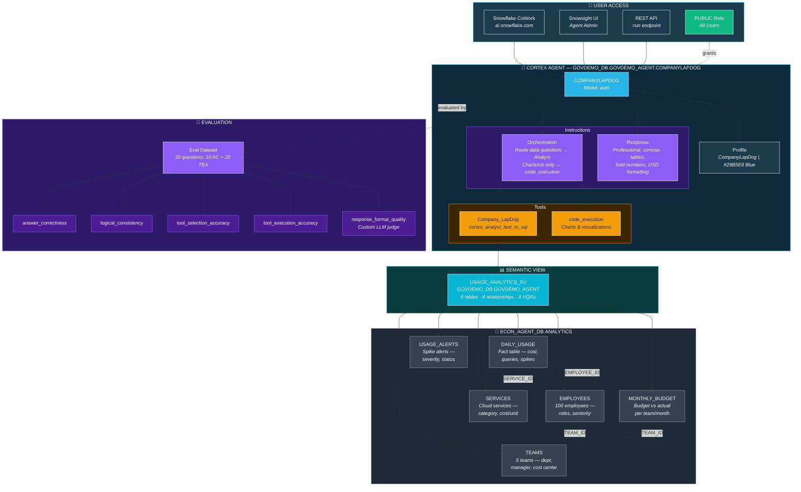

# ❄️ Snowflake Projects ❄️

Welcome! Here you will find insightful and creative ways to interpret data using a powerful AI-powered software used in many data analytical environments around the workforce known as ❄️ [Snowflake](https://www.snowflake.com/en/). 

# Projects

## 💵 Ask the US Economy

📁🔗 [Ask US Economy, files](https://github.com/enzorcortes/Snowflake_Projects/tree/main/askuseconomy)

A conversational AI agent that answers plain-English questions about the US economy — powered entirely by Snowflake.

> *"It's a recession when your neighbor loses his job; it's a depression when you lose your own." — Harry S. Truman*

> *Streamlit live use of the AI*

## 🤖📊 Company Usage Dashboard & CompanyLapDog Agent

📁🔗 [usage-dashboard, files](https://github.com/enzorcortes/Snowflake_Projects/tree/main/usage-dashboard)

A complete Snowflake-native project that simulates a 100-person company's cloud service usage, provides interactive dashboards via Streamlit, exposes data through a semantic view for natural language queries, and deploys a Cortex Agent (CompanyLapDog) for conversational analytics — all secured with role-based access control.

Built entirely on Snowflake using Snowsight Workspaces, Cortex Analyst, and Cortex Agents.

> *"My strengths are not in any- anything related to- it's just hard work... My greatest weaknesses are, um, a-workplace-a-workaholism. Um, I work too hard, I care too much, and sometimes I can be too invested in my job." - Michael Scott, The Office*

🤖🔗 Link to AI Agent: [CompanyLapDog](https://ai.snowflake.com/xntbtwm/mx19130/#/artifacts/share/2e8b0676-74d3-4f3e-bf07-4b2e1d56246f)

You will need a default role and default warehouse set on your Snowflake user profile to use it.

### Agent Architecture:

