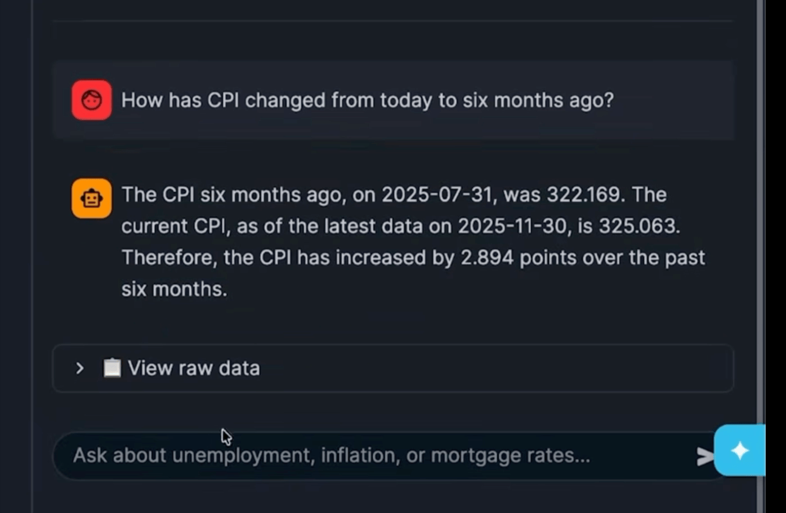

# ❄️ Snowflake Projects ❄️

Welcome! Here you will find insightful and creative ways to interpret data using a powerful AI-powered software used in many data analytical environments around the workforce known as ❄️ [Snowflake](https://www.snowflake.com/en/). 

# Projects

## 💵 Ask the US Economy

A conversational AI agent that answers plain-English questions about the US economy — powered entirely by Snowflake.

📁🔗 [Ask US Economy, files](https://github.com/enzorcortes/Snowflake_Projects/tree/main/askuseconomy)

> *"It's a recession when your neighbor loses his job; it's a depression when you lose your own." — Harry S. Truman*

> *Streamlit live use of the AI*
