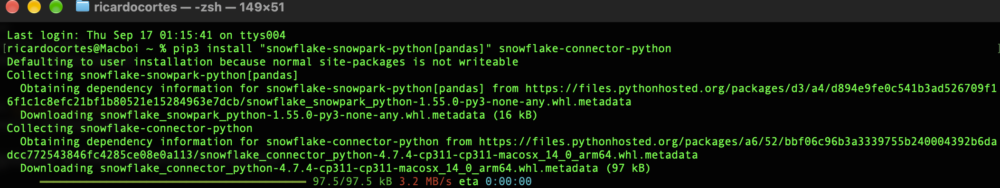

# 💵  AskUSEconomy

A Snowflake-native project that tracks key US economic indicators — **Consumer Price Index (CPI)**, **Unemployment Rate**, and **30-Year Fixed Mortgage Rate** — through an interactive Streamlit dashboard, a Cortex Analyst semantic view for natural language queries, and a conversational Cortex Agent (**Uncle Economy**) for executive-level economic briefings. All secured with role-based access control.

Built entirely on Snowflake using Snowsight Workspaces, Cortex Analyst, and Cortex Agents.

---

## Table of Contents

- [Project Overview](#project-overview)
- [Architecture](#architecture)
- [Data Sources](#data-sources)
- [Economic Metrics Tracked](#economic-metrics-tracked)
- [Database Schema](#database-schema)
- [SQL Files Reference](#sql-files-reference)
- [Streamlit Dashboard](#streamlit-dashboard)
- [Semantic View](#semantic-view)
- [Uncle Economy Agent](#uncle-economy-agent)
- [RBAC Architecture](#rbac-architecture)
- [Real-World Use Cases and Future Projections](#real-world-use-cases-and-future-projections)
- [Future Improvements](#future-improvements)
- [Notebook Notes](#notebook-notes)
- [Project Structure](#project-structure)
- [Setup](#setup)

---

## Project Overview

This project provides three interfaces for exploring US economic data:

| Interface | Audience | How It Works |
|-----------|----------|--------------|
| **Streamlit Dashboard** | Anyone — analysts, executives, students | 6-tab interactive dashboard with KPI cards, trend charts, correlations, and raw data |
| **Semantic View + Cortex Analyst** | Analysts, data teams | Natural language questions translated to SQL automatically |
| **Uncle Economy Agent** | Executive leadership, non-technical users | Conversational AI that delivers concise economic briefings with data-backed insights |

The data refreshes automatically via a **Dynamic Table** with a 1-hour target lag, pulling directly from Snowflake's free public datasets — no ETL pipelines, no external APIs, no maintenance.

---

## Architecture

```
                          ┌──────────────────────┐
                          │   Uncle Economy       │
                          │   (Cortex Agent)      │
                          │                       │
                          │  Tools:               │
                          │  - Cortex Analyst     │
                          │  - Code Execution     │
                          └──────────┬────────────┘
                                     │ natural language → SQL
                                     ▼
┌─────────────────┐     ┌────────────────────────┐
│  Streamlit       │     │  Semantic View          │
│  Dashboard       │     │  US_ECONOMY_SV          │
│  (6 tabs)        │     │                         │
│                  │     │  - 2 logical tables      │
│  - Overview      │     │  - 13 facts/dimensions   │
│  - CPI           │     │  - 8 verified queries    │
│  - Unemployment  │     │  - YoY computed metrics  │
│  - Mortgage      │     └────────────┬─────────────┘
│  - Correlations  │                  │
│  - Raw Data      │                  │
└────────┬─────────┘                  │
         │                            │
         ▼                            ▼
┌──────────────────────────────────────────────────┐
│           ECON_AGENT_DB.ANALYTICS                 │
│                                                   │
│  ECONOMIC_DASHBOARD_LIVE  (Dynamic Table, 1h lag) │
│     └── Raw pivot: CPI + Unemployment + Mortgage  │
│                                                   │
│  ECONOMIC_INDICATORS_MONTHLY  (View)              │
│     └── Monthly-aligned with YoY changes          │
│                                                   │
│         ▲ Live from Snowflake Public Data Free     │
└──────────────────────────────────────────────────┘
         │
         ▼
┌──────────────────────────────────────────────────┐
│                 RBAC Layer                         │
│                                                   │
│  ECON_VIEWER   → dashboard only                   │
│  ECON_ANALYST  → + SELECT on tables & semantic    │
│  ECON_ADMIN    → + INSERT/UPDATE/DELETE            │
└──────────────────────────────────────────────────┘
```

---

## Data Sources

All data comes from **Snowflake Marketplace** free public datasets — no external connections or API keys required.

| Source Table | Provider | Indicators |
|-------------|----------|------------|
| `SNOWFLAKE_PUBLIC_DATA_FREE.PUBLIC_DATA_FREE.FINANCIAL_ECONOMIC_INDICATORS_TIMESERIES` | Snowflake Public Data Free | CPI, Unemployment Rate (BLS) |
| `SNOWFLAKE_PUBLIC_DATA_FREE.PUBLIC_DATA_FREE.FREDDIE_MAC_HOUSING_TIMESERIES` | Snowflake Public Data Free | 30-Year Fixed Mortgage Rate (Freddie Mac) |

The dataset can be found for free within the Snowflake Marketplace as `SNOWFLAKE_PUBLIC_DATA_FREE.PUBLIC_DATA_FREE.FINANCIAL_ECONOMIC_INDICATORS_TIMESERIES`.

> **Note:** CPI and Unemployment are published **monthly** by the Bureau of Labor Statistics. Mortgage rates are published **weekly** by Freddie Mac. The monthly view averages weekly mortgage data to align all three indicators.

---

## Economic Metrics Tracked

### Primary Indicators

| Metric | Description | Source | Frequency | History |
|--------|-------------|--------|-----------|---------|
| **CPI (Consumer Price Index)** | All items, 1982-84 = 100, seasonally adjusted. The primary measure of consumer inflation in the US. | Bureau of Labor Statistics | Monthly | 1947–present |
| **Unemployment Rate** | Civilian labor force, 20 years and over, seasonally adjusted. Measures the percentage of the labor force that is jobless and actively seeking work. | Bureau of Labor Statistics | Monthly | 1948–present |
| **30-Year Fixed Mortgage Rate** | National average rate for a 30-year fixed-rate mortgage. The benchmark for US housing affordability. | Freddie Mac | Weekly (averaged to monthly) | 1971–present |

### Derived Metrics (Computed in the Monthly View)

| Metric | Column | Description |
|--------|--------|-------------|
| **Inflation Rate** | `CPI_YOY_PCT` | Year-over-year percentage change in CPI — the commonly reported "inflation rate" |
| **Unemployment YoY Change** | `UNEMPLOYMENT_YOY_CHANGE_BPS` | Year-over-year change in unemployment rate in basis points |
| **Mortgage YoY Change** | `MORTGAGE_YOY_CHANGE_BPS` | Year-over-year change in mortgage rate in basis points |

### Why These Three Indicators Matter Together

These three metrics form the core of the **Fed's dual mandate** (price stability + maximum employment) plus the **housing market** pulse:

- **CPI rising + Unemployment falling** → overheating economy, Fed likely to raise rates
- **CPI falling + Unemployment rising** → cooling economy, Fed may cut rates
- **Mortgage rates** track the 10-year Treasury yield, which responds to Fed policy expectations
- Together they tell a coherent story about the cost of living, the job market, and housing affordability

---

## Database Schema

All objects live in `ECON_AGENT_DB.ANALYTICS`.

| Object | Type | Rows | Purpose |
|--------|------|------|---------|
| `ECONOMIC_DASHBOARD_LIVE` | Dynamic Table | ~3,700 | Raw pivot of all three indicators at their native frequencies. Refreshes every hour. |
| `ECONOMIC_INDICATORS_MONTHLY` | View | ~950 | Monthly-aligned data with YoY changes. Powers the dashboard and semantic view. |

### Column Reference

**ECONOMIC_DASHBOARD_LIVE** — raw data, mixed frequencies:
| Column | Type | Description |
|--------|------|-------------|
| `DATE` | DATE | Observation date |
| `CPI` | FLOAT | CPI index value (NULL on non-CPI dates) |
| `UNEMPLOYMENT_RATE` | FLOAT | Unemployment rate as decimal (NULL on non-unemployment dates) |
| `MORTGAGE_RATE_30Y` | FLOAT | 30-year mortgage rate as decimal (NULL on non-mortgage dates) |

**ECONOMIC_INDICATORS_MONTHLY** — monthly aligned, dashboard-ready:
| Column | Type | Description |
|--------|------|-------------|
| `MONTH` | DATE | First day of month |
| `CPI` | FLOAT | CPI index value |
| `UNEMPLOYMENT_RATE` | FLOAT | Unemployment rate as decimal |
| `MORTGAGE_RATE_30Y` | FLOAT | Monthly average mortgage rate as decimal |
| `CPI_YOY_PCT` | FLOAT | CPI year-over-year change (%) — inflation rate |
| `UNEMPLOYMENT_YOY_CHANGE_BPS` | FLOAT | Unemployment YoY change (basis points) |
| `MORTGAGE_YOY_CHANGE_BPS` | FLOAT | Mortgage rate YoY change (basis points) |

---

## SQL Files Reference

| File | Purpose | When to Run |
|------|---------|-------------|
| [`setup.sql`](AskUSEconomy/setup.sql) | Creates database, schema, warehouse, dynamic table (`ECONOMIC_DASHBOARD_LIVE`), and monthly-aligned view (`ECONOMIC_INDICATORS_MONTHLY`). Includes verification queries. | Once to initialize. Re-run safely — uses `CREATE OR REPLACE` / `IF NOT EXISTS`. |
| [`rbac.sql`](AskUSEconomy/rbac.sql) | Creates the 3-tier role hierarchy (`ECON_VIEWER` / `ECON_ANALYST` / `ECON_ADMIN`) with all grants on database, schema, tables, warehouse, and semantic view. Includes future grants. | Once after `setup.sql`. Re-run safely — uses `IF NOT EXISTS`. |
| [`CreateDB.sql`](AskUSEconomy/CreateDB.sql) | Original standalone DB/schema/warehouse creation. Preserved for reference. | Superseded by `setup.sql`. |
| [`CPI.sql`](AskUSEconomy/CPI.sql) | Standalone query for CPI data (12-month window). | Ad-hoc exploration. |
| [`Unemployment.sql`](AskUSEconomy/Unemployment.sql) | Standalone query for unemployment data (12-month window). | Ad-hoc exploration. |
| [`30 Year Mortage.sql`](AskUSEconomy/30%20Year%20Mortage.sql) | Standalone query for 30-year mortgage rate (12-month window). | Ad-hoc exploration. |
| [`Dynamic Table.sql`](AskUSEconomy/Dynamic%20Table.sql) | Original dynamic table creation with preview queries. | Superseded by `setup.sql`. |
| [`Preview.sql`](AskUSEconomy/Preview.sql) | Quick `SELECT * LIMIT 10` on the raw source data. | Ad-hoc exploration. |

### Setup SQL Walkthrough

The `setup.sql` script does the following in order:

1. **Infrastructure** — Creates `ECON_AGENT_DB` database, `ANALYTICS` schema, and `COMPUTE_WH` warehouse (XSMALL, auto-suspend 60s)
2. **Dynamic Table** — Pivots CPI, unemployment, and mortgage data from two source tables into a single `ECONOMIC_DASHBOARD_LIVE` table with 1-hour refresh lag
3. **Monthly View** — Creates `ECONOMIC_INDICATORS_MONTHLY` that:
   - Aligns CPI (monthly) + Unemployment (monthly) + Mortgage (weekly → monthly average)
   - Computes YoY changes using `LAG(..., 12)` window functions
   - Joins all three via `FULL OUTER JOIN` on truncated month
4. **Verification** — Row counts and a 12-month preview

---

## Streamlit Dashboard

A 6-tab interactive dashboard built with Streamlit in Snowflake (Workspace container runtime).

### Tabs

| Tab | What It Shows |
|-----|--------------|
| **Overview** | KPI cards with sparklines (CPI, Unemployment, Mortgage) + dual-axis CPI vs Unemployment chart + Mortgage trend |
| **CPI** | CPI index over time + YoY inflation rate bar chart + month-over-month change |
| **Unemployment** | Unemployment rate trend + YoY change in basis points + period min/max range |
| **Mortgage Rates** | 30-year rate trend + YoY change + period min/max range |
| **Correlations** | Correlation matrix + CPI vs Mortgage scatter + Unemployment vs Mortgage scatter |
| **Raw Data** | Searchable table of all monthly data with formatted percentages and indices |

### Features

- **Sidebar filters**: Date range picker applies across all tabs
- **Refresh button**: Clears cached data immediately
- **5-minute cache TTL**: Queries automatically refresh within 5 minutes
- **KPI sparklines**: 12-month mini trend lines in metric cards
- **Delta indicators**: YoY changes shown with directional color coding (inverse for unemployment/mortgage — down is good)

### Running the Dashboard

1. Open the `AskUSEconomy/` folder in Snowsight Workspaces
2. Click **Run** on `streamlit_app.py`

---

## Semantic View

The semantic view (`US_ECONOMY_SV`) defines the economic data model in business terms so Cortex Analyst and Uncle Economy can translate natural language into correct SQL.

**Location:** `ECON_AGENT_DB.ANALYTICS.US_ECONOMY_SV`

### What It Defines

- **2 logical tables**: `ECONOMIC_INDICATORS_MONTHLY` (enriched monthly data) and `ECONOMIC_DASHBOARD_LIVE` (raw daily/weekly data)
- **13 facts and dimensions**: CPI, Unemployment Rate, Mortgage Rate, plus YoY changes and time dimensions
- **8 verified queries (VQRs)** that teach the AI how to answer common questions correctly

### Verified Queries

| Question | What It Answers |
|----------|----------------|
| What is the latest CPI trend over the past 12 months? | Monthly CPI values, most recent year |
| What is the current unemployment rate and trend? | Unemployment rate as percentage, 12-month window |
| What are the latest 30-year mortgage rates? | Mortgage rate as percentage, 12-month window |
| What is the current inflation rate and how has it changed? | CPI YoY percentage change (inflation), 24-month window |
| Compare all three economic indicators over the past 2 years | Side-by-side CPI + Unemployment + Mortgage, 24 months |
| How have YoY changes compared recently? | All three YoY metrics together, 12 months |
| What were the highs and lows since 2020? | Min/max of each indicator since January 2020 |
| When was inflation above 5%? | Months where CPI YoY exceeded 5% |

### YAML Definition

See [`cortex_project/US_ECONOMY_SV.sv.yaml`](cortex_project/US_ECONOMY_SV.sv.yaml) for the full semantic model.

---

## Uncle Economy Agent

A Cortex Agent that provides conversational economic briefings over the US economy data. Deployed to `ECON_AGENT_DB.USECON_AGENT.UNCLEECONOMY`.

### Architecture

```
User Question (e.g. "How's inflation looking?")
     │
     ▼
┌─────────────────────────────────┐
│        Uncle Economy Agent       │
│                                  │
│  Instructions:                   │
│  - Senior economic briefing      │
│    assistant for executives      │
│  - Lead with the key takeaway    │
│  - 2-3 supporting data points    │
│  - Rates/percentages to 1 d.p.  │
│  - Frame changes in context      │
│  - No jargon, no raw SQL         │
│  - End with outlook/implication  │
│                                  │
│  Orchestration:                  │
│  - Analyst tool FIRST for all    │
│    data questions                │
│  - Code execution ONLY for       │
│    charts & visualizations       │
│  - Never guess at numbers        │
├──────────────────────────────────┤
│  Tools:                          │
│                                  │
│  1. UncleEconomy                 │
│     (cortex_analyst_text_to_sql) │
│     → US_ECONOMY_SV              │
│     → Translates NL to SQL       │
│     → Returns structured data    │
│                                  │
│  2. code_execution               │
│     → Python runtime             │
│     → Charts & visualizations    │
│     → Custom calculations        │
└──────────────────────────────────┘
```

### Tools

| Tool | Type | Purpose |
|------|------|---------|
| **UncleEconomy** | `cortex_analyst_text_to_sql` | Primary tool. Queries the semantic view for CPI, unemployment, mortgage rates, and YoY comparisons. Always queries data before making claims. |
| **code_execution** | Python runtime | Secondary tool. Used only when the user explicitly requests charts, visualizations, or calculations that SQL alone cannot produce. |

### Response Style

Uncle Economy is instructed to:
- Lead with the key takeaway, not buried in details
- Use bullet points for multi-metric summaries
- Present rates with one decimal place (e.g., "3.9%" not "0.039")
- Frame changes in context (e.g., "up 0.3pp from last month" or "highest since Q2 2023")
- Say "inflation rate" not "CPI YoY percentage change"
- End longer briefings with a one-sentence outlook
- Never include SQL or technical details unless asked

### Evaluation

The agent includes evaluation configurations with both built-in and custom metrics:

**Built-in metrics:**
- `answer_correctness` — Is the answer factually correct?
- `logical_consistency` — Does the reasoning hold up?
- `tool_selection_accuracy` — Did it pick the right tool?
- `tool_execution_accuracy` — Did the tool call execute correctly?

**Custom metric — `executive_readiness` (1-10):**
Scores responses on executive briefing quality: leads with takeaway, uses bullet points, presents rates correctly, frames changes in context, avoids jargon, includes outlook/implication, contains specific verifiable numbers.

### Agent Files

| File | Purpose |
|------|---------|
| `cortex_project/UNCLEECONOMY.agent.yaml` | Agent definition (instructions, tools, orchestration) |
| `cortex_project/US_ECONOMY_SV.sv.yaml` | Semantic view the agent queries |
| `cortex_project/uncleeconomy_eval_*.eval.yaml` | Evaluation configurations |
| `cortex_project/uncleeconomy_eval_*.metrics.yaml` | Custom evaluation metrics (executive_readiness) |
| `cortex_project/cortex-project.yaml` | Project manifest linking all artifacts |

---

## RBAC Architecture

Three-tier role hierarchy controlling access to the database, dashboard, and semantic view.

```
ACCOUNTADMIN
  └── ECON_ADMIN
       └── ECON_ANALYST
            └── ECON_VIEWER
```

### Role Permissions

| Privilege | ECON_VIEWER | ECON_ANALYST | ECON_ADMIN |
|-----------|:---:|:---:|:---:|
| USAGE on database & schema | Yes | Yes (inherited) | Yes (inherited) |
| USAGE on warehouse | Yes | Yes (inherited) | Yes (inherited) |
| SELECT on all tables & views | - | Yes | Yes (inherited) |
| SELECT on dynamic tables | - | Yes | Yes (inherited) |
| SELECT on semantic view | - | Yes | Yes (inherited) |
| INSERT/UPDATE/DELETE on tables | - | - | Yes |
| Streamlit dashboard access | Yes (via app owner) | Yes | Yes |
| Cortex Analyst / Agent queries | - | Yes | Yes |
| Future table grants (auto) | - | SELECT | SELECT + INSERT/UPDATE/DELETE |
| Future view/DT grants (auto) | - | SELECT | SELECT (inherited) |

### Assigning Users

```sql
GRANT ROLE ECON_VIEWER  TO USER jane_doe;     -- dashboard only
GRANT ROLE ECON_ANALYST TO USER john_smith;    -- read + Cortex Analyst + Agent
GRANT ROLE ECON_ADMIN   TO USER team_lead;     -- full access
```

See [`rbac.sql`](AskUSEconomy/rbac.sql) for the complete role creation and grant statements.

---

## Real-World Use Cases and Future Projections

### How This Is Useful Now

**Economic monitoring for business decisions:**
- Track inflation trends to inform pricing strategy and contract negotiations
- Monitor unemployment as a leading indicator for labor market tightness and hiring plans
- Watch mortgage rates for real estate investment timing and housing market exposure

**Executive briefings:**
- Uncle Economy turns raw BLS/Freddie Mac data into plain-English summaries
- No SQL knowledge required — ask questions like "How's inflation trending?" or "When were mortgage rates lowest?"
- Correlation analysis reveals relationships between indicators that inform strategic planning

**Education and research:**
- 75+ years of CPI data and 50+ years of mortgage data for academic analysis
- Pre-built YoY calculations save hours of data wrangling
- Semantic view makes the data accessible to students and non-technical researchers

### Forward-Looking Applications

**Recession probability modeling:**
- The relationship between CPI, unemployment, and mortgage rates historically predicts recessions
- An inverted yield curve (approximated by mortgage rate behavior) combined with rising unemployment has preceded every US recession since 1970

**Housing affordability index:**
- Combine mortgage rates with median home prices (available in the same Freddie Mac dataset) to calculate monthly affordability
- Track how many months of median income are needed for a down payment

**Fed policy anticipation:**
- CPI trajectory + unemployment trend = likely Fed rate decision
- Build alerts when indicators cross thresholds (e.g., inflation > 3%, unemployment < 4%)

---

## Future Improvements

### Data Expansion
- **Add GDP growth rate** — completes the macroeconomic picture (available in the same Snowflake public data)
- **Add Federal Funds Rate** — directly shows Fed policy decisions alongside the indicators they're responding to
- **Add 10-Year Treasury Yield** — the benchmark that drives mortgage rates
- **Add median home prices** — enables a housing affordability composite metric
- **Add consumer confidence index** — leading indicator that often moves before hard data

### Analytics Enhancements
- **Forecasting with Cortex ML** — use Snowflake's built-in forecasting functions to project CPI, unemployment, and mortgage rates 3-6 months ahead
- **Anomaly detection** — flag unusual indicator movements (e.g., CPI jumping 0.5% in a single month)
- **Recession probability score** — composite metric combining all indicators into a single risk gauge
- **Regional breakdowns** — CPI by metro area, unemployment by state (both available in the source data)

### Platform Improvements
- **Row access policies** — restrict data by region or sensitivity level for multi-tenant deployments
- **Masking policies** — hide raw values from certain roles while still allowing trend analysis
- **Dynamic alerts** — Snowflake Alerts that notify when inflation crosses thresholds or unemployment spikes
- **Scheduled tasks** — automated monthly reports delivered via email or Slack when new data drops
- **Additional VQRs** — expand verified queries for the semantic view based on actual user question patterns
- **Agent evaluation expansion** — grow the eval dataset to cover edge cases and improve Uncle Economy's accuracy over time

### Integration Opportunities
- **Snowflake Intelligence (CoWork)** — connect Uncle Economy as a conversational interface within CoWork for broader organizational access
- **Data sharing** — publish the monthly view as a Snowflake listing for cross-account consumption
- **dbt integration** — model the transformations in dbt for version-controlled, testable data pipelines
- **External data blending** — combine with company-specific data (revenue, headcount, cost of goods) to correlate internal metrics with macroeconomic conditions

---

## Notebook Notes

A step-by-step notebook with SQL, Snowpark, Dynamic Tables, Cortex Analyst, and Streamlit App UI has been generated and submitted in this repo as a PDF for your convenience if you want to recreate it yourself. This notebook was generated via Codex Work after an incohesive documentation effort was done from a combination of .txt files and VS Code.

The reference notebook can be found [here](https://github.com/enzorcortes/Snowflake_Projects/blob/main/askuseconomy/Snowflake%20-%20Ask%20US%20Economy%20Notebook.pdf).

### Snowpark Connection Setup

If you want to connect to this project externally using Snowpark (e.g., from a local Python environment), follow these notes:

**Step 2.1 — Local Environment Prerequisites**

- If on a MacBook, make sure [Homebrew](https://downloads.install.guide/suym-brew/Set-Up-Your-Mac-with-Homebrew.dmg?utm_source=home&utm_medium=hero_cta&utm_campaign=suym-brew_setup) or [Xcode Command Line Tools](https://downloads.install.guide/suym-cli/Set-Up-Your-Mac-for-the-Command-Line.dmg?utm_source=home&utm_medium=hero_cta&utm_campaign=suym-cli_setup) (you need the uv) and [Python for Mac](https://downloads.install.guide/suym-python/Set-Up-Your-Mac-for-Python.dmg?utm_source=home&utm_medium=hero_cta&utm_campaign=suym-python_setup) are downloaded. This must be done BEFORE installing Snowpark in your local terminal. I found help via the [Mac Install Guide](https://mac.install.guide).
- If on a Mac, instead of typing `pip install "snowflake-snowpark-python[pandas]" snowflake-connector-python`, you must type `pip3 install "snowflake-snowpark-python[pandas]" snowflake-connector-python` as the BASH is in zsh and has different formatting.



> *Using `pip3` in Terminal.*

**Step 2.2 — Connection Parameters**

- To replace `<your-account>` for the `connection_params`, navigate within Snowflake to your **Account Details > Config File** > copy and paste the `account = "_______-_______"` (alphanumeric, 14-character code, 7 characters separated by a dash). Repeat for `<your-username>`, labeled `user = "______"` in the Config File.
- The password is tricky as it requires either **MFA** (multi-factor authentication) or a **temporary generated token** via **Settings > Authentication > Programmatic Access Tokens > Generate Token**. Copy and paste the given token (you may receive an email alerting you of this action, do not be alarmed) to the `<your-password>` line.

---

## Project Structure

```
workspace/
├── AskUSEconomy/                        # Streamlit dashboard app
│   ├── snowflake.yml                     # App config (warehouse, compute pool)
│   ├── streamlit_app.py                  # Dashboard code (6 tabs, sidebar filters)
│   ├── pyproject.toml                    # Python dependencies
│   ├── setup.sql                         # DB + dynamic table + monthly view
│   ├── rbac.sql                          # 3-tier role hierarchy + grants
│   ├── .streamlit/
│   │   └── config.toml                   # Streamlit theme config
│   ├── CPI.sql                           # Standalone CPI query
│   ├── Unemployment.sql                  # Standalone unemployment query
│   ├── 30 Year Mortage.sql               # Standalone mortgage query
│   ├── CreateDB.sql                      # Original DB creation (reference)
│   ├── Dynamic Table.sql                 # Original dynamic table (reference)
│   └── Preview.sql                       # Quick data preview
│
├── cortex_project/                       # Semantic view + Agent artifacts
│   ├── cortex-project.yaml               # Project manifest
│   ├── US_ECONOMY_SV.sv.yaml            # Semantic view definition
│   ├── UNCLEECONOMY.agent.yaml          # Uncle Economy agent definition
│   └── uncleeconomy_eval_*.yaml         # Evaluation configs + custom metrics
│
└── README.md
```

---

## Setup

### Prerequisites

- A Snowflake account with ACCOUNTADMIN access
- Snowsight Workspaces enabled
- A warehouse (default: `COMPUTE_WH`)
- A compute pool (default: `SYSTEM_COMPUTE_POOL_CPU`)
- Access to Snowflake Public Data Free (available in all accounts)

### Steps

1. **Create the database and objects**: Run `AskUSEconomy/setup.sql` in a Snowflake worksheet
2. **Set up RBAC**: Run `AskUSEconomy/rbac.sql` in a Snowflake worksheet
3. **Deploy the semantic view**: The `cortex_project/US_ECONOMY_SV.sv.yaml` is deployed via `cortex agent-studio sv-deploy`
4. **Deploy the agent**: The `cortex_project/UNCLEECONOMY.agent.yaml` is deployed via the Cortex Agent Studio
5. **Run the dashboard**: Open `AskUSEconomy/` in Snowsight Workspaces and click **Run**

### Quick Verification

After running `setup.sql`, verify the data is flowing:

```sql
-- Check row counts
SELECT 'ECONOMIC_DASHBOARD_LIVE' AS TABLE_NAME, COUNT(*) AS ROWS
FROM ECON_AGENT_DB.ANALYTICS.ECONOMIC_DASHBOARD_LIVE
UNION ALL
SELECT 'ECONOMIC_INDICATORS_MONTHLY', COUNT(*)
FROM ECON_AGENT_DB.ANALYTICS.ECONOMIC_INDICATORS_MONTHLY;

-- Check latest data
SELECT * FROM ECON_AGENT_DB.ANALYTICS.ECONOMIC_INDICATORS_MONTHLY
ORDER BY MONTH DESC LIMIT 5;
```

---

*Built with Snowflake Snowsight Workspaces, Streamlit in Snowflake, Cortex Analyst, and Cortex Agents.*
