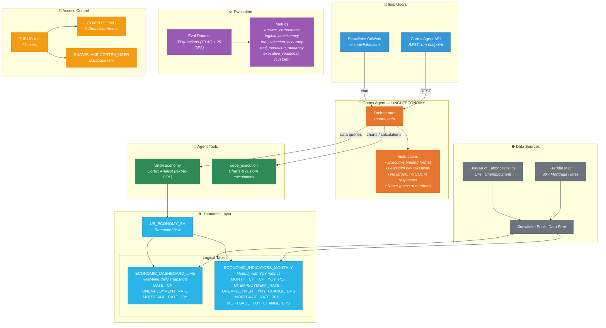

```mermaid
flowchart TB
    subgraph Users["👤 End Users"]
        CoWork["Snowflake CoWork<br/><i>ai.snowflake.com</i>"]
        API["Cortex Agent API<br/><i>REST :run endpoint</i>"]
    end

    subgraph Agent["🤖 Cortex Agent — UNCLEECONOMY"]
        direction TB
        Orchestrator["Orchestrator<br/><i>model: auto</i>"]
        Instructions["Instructions<br/><i>• Executive briefing format</i><br/><i>• Lead with key takeaway</i><br/><i>• No jargon, no SQL in responses</i><br/><i>• Never guess at numbers</i>"]
    end

    subgraph Tools["🔧 Agent Tools"]
        Analyst["UncleEconomy<br/><i>Cortex Analyst (text-to-SQL)</i>"]
        CodeExec["code_execution<br/><i>Charts & custom calculations</i>"]
    end

    subgraph SemanticLayer["📊 Semantic Layer"]
        SV["US_ECONOMY_SV<br/><i>Semantic View</i>"]
        subgraph Tables["Logical Tables"]
            Live["ECONOMIC_DASHBOARD_LIVE<br/><i>Real-time daily snapshots</i><br/>DATE · CPI · UNEMPLOYMENT_RATE<br/>MORTGAGE_RATE_30Y"]
            Monthly["ECONOMIC_INDICATORS_MONTHLY<br/><i>Monthly with YoY metrics</i><br/>MONTH · CPI · CPI_YOY_PCT<br/>UNEMPLOYMENT_RATE · UNEMPLOYMENT_YOY_CHANGE_BPS<br/>MORTGAGE_RATE_30Y · MORTGAGE_YOY_CHANGE_BPS"]
        end
    end

    subgraph DataSources["🌐 Data Sources"]
        BLS["Bureau of Labor Statistics<br/><i>CPI · Unemployment</i>"]
        Freddie["Freddie Mac<br/><i>30Y Mortgage Rates</i>"]
        SPDF["Snowflake Public Data Free"]
    end

    subgraph Eval["✅ Evaluation"]
        Dataset["Eval Dataset<br/><i>30 questions (10 AC + 20 TEA)</i>"]
        Metrics["Metrics<br/><i>answer_correctness</i><br/><i>logical_consistency</i><br/><i>tool_selection_accuracy</i><br/><i>tool_execution_accuracy</i><br/><i>executive_readiness (custom)</i>"]
    end

    subgraph Access["🔐 Access Control"]
        Public["PUBLIC role<br/><i>All users</i>"]
        Warehouse["COMPUTE_WH<br/><i>X-Small warehouse</i>"]
        CortexRole["SNOWFLAKE.CORTEX_USER<br/><i>Database role</i>"]
    end

    CoWork -->|chat| Orchestrator
    API -->|REST| Orchestrator
    Orchestrator --> Instructions
    Orchestrator -->|data queries| Analyst
    Orchestrator -->|charts / calculations| CodeExec
    Analyst --> SV
    SV --> Live
    SV --> Monthly
    BLS --> SPDF
    Freddie --> SPDF
    SPDF --> Live
    SPDF --> Monthly
    Dataset --> Metrics
    Public --> Warehouse
    Public --> CortexRole

    classDef agent fill:#E8762D,stroke:#C45A1A,color:#fff
    classDef tool fill:#2E8B57,stroke:#1B5E3B,color:#fff
    classDef semantic fill:#29B5E8,stroke:#1A8AB5,color:#fff
    classDef data fill:#6C757D,stroke:#495057,color:#fff
    classDef eval fill:#9B59B6,stroke:#7D3C98,color:#fff
    classDef access fill:#F39C12,stroke:#D68910,color:#fff
    classDef user fill:#3498DB,stroke:#2471A3,color:#fff

    class Orchestrator,Instructions agent
    class Analyst,CodeExec tool
    class SV,Live,Monthly semantic
    class BLS,Freddie,SPDF data
    class Dataset,Metrics eval
    class Public,Warehouse,CortexRole access
    class CoWork,API user
```
