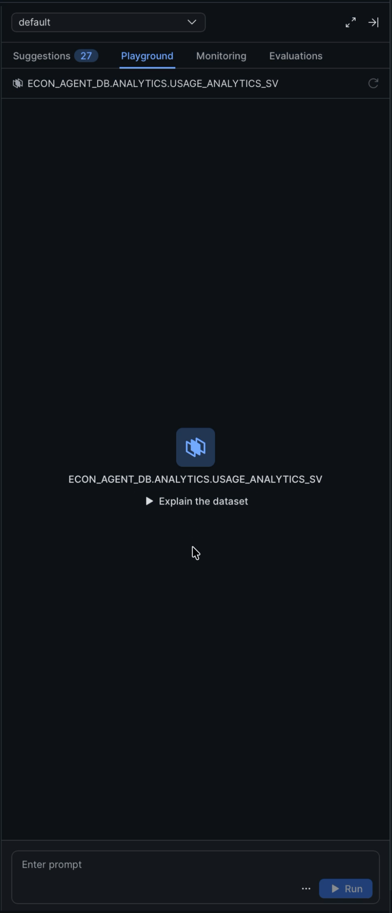
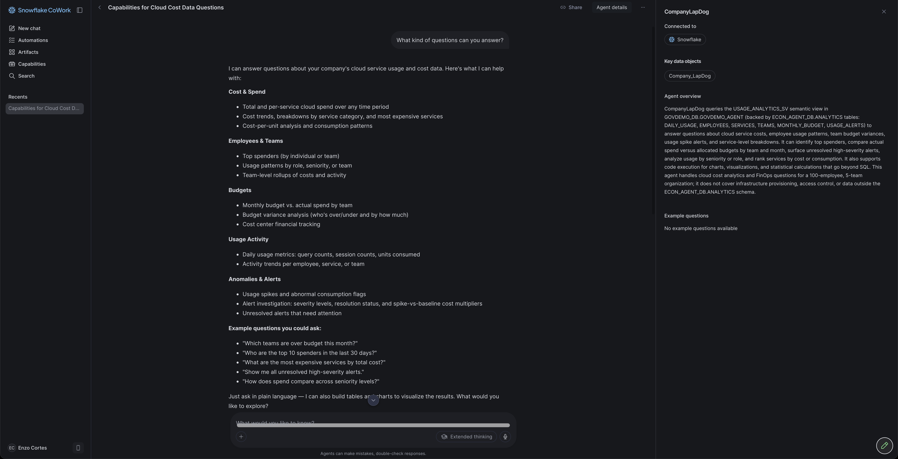
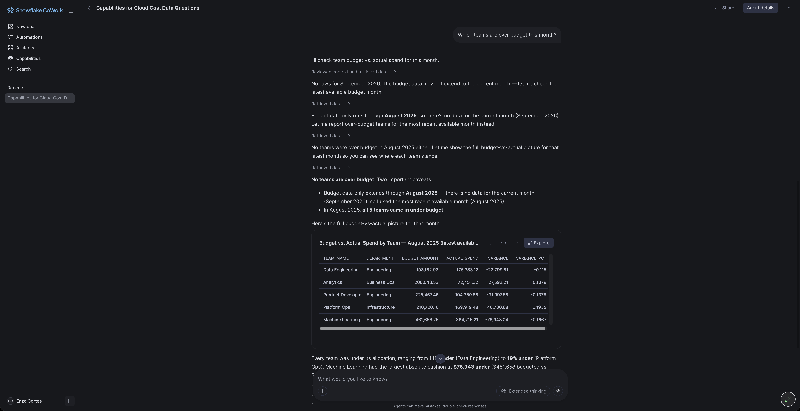
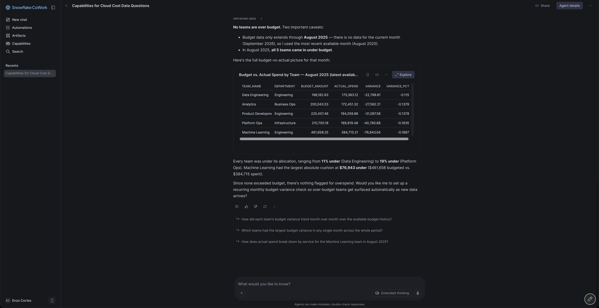
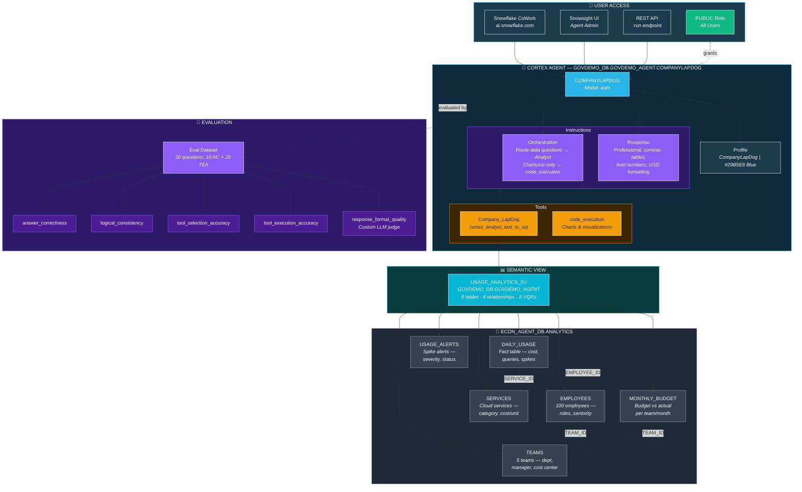
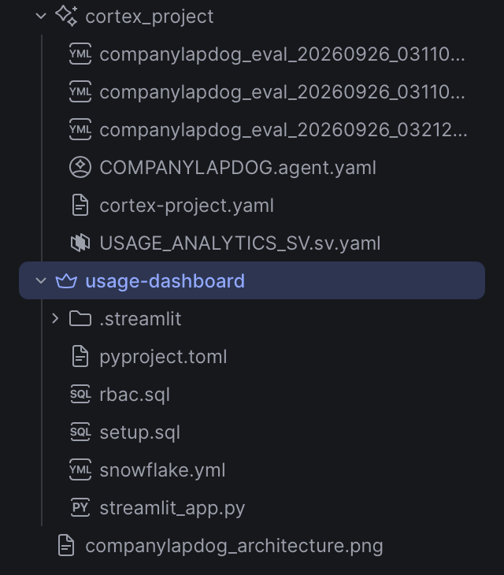

# Company Usage Dashboard & CompanyLapDog Agent

A complete Snowflake-native project that simulates a 100-person company's cloud service usage, provides interactive dashboards via Streamlit, exposes data through a semantic view for natural language queries, and deploys a Cortex Agent (CompanyLapDog) for conversational analytics — all secured with role-based access control.

Built entirely on Snowflake using Snowsight Workspaces, Cortex Analyst, and Cortex Agents.

---

## Table of Contents

- [Project Overview](#project-overview)
- [Architecture](#architecture)
- [The Simulated Company](#the-simulated-company)
- [Database Schema](#database-schema)
- [Streamlit Dashboard](#streamlit-dashboard)
- [Semantic View](#semantic-view)
- [CompanyLapDog Agent](#companylapdog-agent)
- [RBAC Architecture](#rbac-architecture)
- [SQL Files Reference](#sql-files-reference)
- [Real-World Applications](#real-world-applications)
- [Project Structure](#project-structure)
- [Setup](#setup)

---

## Project Overview

This project demonstrates an end-to-end analytics platform for tracking cloud service consumption across an organization. It answers questions like:

- Which teams are burning through budget the fastest?
- Who are the top spenders and what services are they using?
- Are there usage spikes that indicate runaway jobs or misconfigurations?
- How does spending vary by seniority, team, or service category?

Three interfaces serve different user needs:

| Interface | Audience | How It Works |
|-----------|----------|--------------|
| **Streamlit Dashboard** | Business users, managers | Fixed visualizations with filters — click and explore |
| **Semantic View + Cortex Analyst** | Analysts, data teams | Natural language questions translated to SQL automatically |
| **CompanyLapDog Agent** | Anyone | Conversational AI that answers questions, generates charts, and synthesizes multi-dimensional analysis |

---

## Architecture

```
                          ┌──────────────────────┐
                          │   CompanyLapDog       │
                          │   (Cortex Agent)      │
                          │                       │
                          │  Tools:               │
                          │  - Cortex Analyst     │
                          │  - Code Execution     │
                          └──────────┬────────────┘
                                     │ natural language → SQL
                                     ▼
┌─────────────────┐     ┌────────────────────────┐
│  Streamlit       │     │  Semantic View          │
│  Dashboard       │     │  USAGE_ANALYTICS_SV     │
│  (6 tabs)        │     │                         │
│                  │     │  - 6 logical tables      │
│  - Monthly Costs │     │  - 4 relationships       │
│  - Services      │     │  - 8 verified queries    │
│  - Top Spenders  │     │  - Metrics & dimensions  │
│  - Spike Alerts  │     └────────────┬─────────────┘
│  - Budget vs Act │                  │
│  - All Employees │                  │
└────────┬─────────┘                  │
         │                            │
         ▼                            ▼
┌──────────────────────────────────────────────────┐
│              ECON_AGENT_DB.ANALYTICS              │
│                                                   │
│  TEAMS ◄── EMPLOYEES ◄── DAILY_USAGE ──► SERVICES│
│    ▲                                              │
│    └── MONTHLY_BUDGET     USAGE_ALERTS            │
└──────────────────────────────────────────────────┘
         │
         ▼
┌──────────────────────────────────────────────────┐
│                 RBAC Layer                         │
│                                                   │
│  USAGE_VIEWER  → dashboard only                   │
│  USAGE_ANALYST → + SELECT on tables & semantic    │
│  USAGE_ADMIN   → + INSERT/UPDATE/DELETE           │
└──────────────────────────────────────────────────┘
```

---

## The Simulated Company

The project models a fictional tech company called **AcmeCorp** with the following structure:

### Organization: 100 employees across 5 teams

| Team | Department | Manager | Headcount | Primary Services |
|------|-----------|---------|-----------|-----------------|
| Data Engineering | Engineering | Sarah Chen | 20 | Snowflake Compute, Storage, Serverless Tasks |
| Machine Learning | Engineering | Marcus Johnson | 20 | Cortex AI Functions, Snowpark, Cortex Search |
| Analytics | Business Ops | Priya Patel | 20 | Compute, Cortex Analyst, Materialized Views |
| Platform Ops | Infrastructure | David Kim | 20 | Compute, Replication, Serverless Tasks |
| Product Development | Engineering | Elena Rodriguez | 20 | Snowpark, Compute, Cortex AI Functions |

### Employee distribution

Each team has employees across 5 seniority levels: **Junior**, **Mid**, **Senior**, **Staff**, and **Lead**. Each level has a usage multiplier that reflects real-world patterns — senior engineers run heavier workloads than juniors.

### 10 cloud services tracked

Snowflake Compute, Snowflake Storage, Cortex AI Functions, Snowpark Compute, Data Transfer, Cortex Search, Replication, Serverless Tasks, Materialized Views, and Cortex Analyst — each with realistic per-unit pricing.

### Metrics monitored

- **Daily cost per employee per service** (COST_USD, UNITS_CONSUMED)
- **Query and session volume** (QUERY_COUNT, SESSION_COUNT)
- **Usage spikes** flagged at ~2% frequency with 3-8x multipliers
- **Monthly budgets** set 5-25% above actual spend per team
- **Spike alerts** with severity levels (CRITICAL, HIGH, MEDIUM) and resolution tracking

### Data realism

The synthetic data models real patterns:

- **Team-service affinity**: ML team uses more AI functions, Data Engineering uses more compute
- **Seniority scaling**: Staff engineers consume ~4.5x what juniors do
- **Weekday/weekend patterns**: Weekend usage drops to ~15% of weekday levels
- **Monthly growth**: 3% month-over-month increase simulating organic adoption
- **Random daily noise**: 0.3x-1.7x variation for realistic day-to-day fluctuation
- **Spike injection**: ~2% of usage days get a 3-8x multiplier, triggering alerts

---

## Database Schema

All tables live in `ECON_AGENT_DB.ANALYTICS`.

| Table | Rows | Purpose |
|-------|------|---------|
| `TEAMS` | 5 | Team definitions with department and cost center |
| `EMPLOYEES` | 100 | Employee profiles with role, seniority, and team assignment |
| `SERVICES` | 10 | Cloud service catalog with per-unit pricing |
| `DAILY_USAGE` | ~116,500 | 12 months of daily usage records (Sep 2024 - Aug 2025) |
| `USAGE_ALERTS` | ~1,800 | Spike detection events with severity and resolution status |
| `MONTHLY_BUDGET` | 60 | Budget vs actual spend per team per month |

### Entity relationships

```
TEAMS (1) ◄──── (N) EMPLOYEES (1) ◄──── (N) DAILY_USAGE (N) ────► (1) SERVICES
TEAMS (1) ◄──── (N) MONTHLY_BUDGET
EMPLOYEES (1) ◄──── (N) USAGE_ALERTS (N) ────► (1) SERVICES
```

See [`setup.sql`](usage-dashboard/setup.sql) for the complete DDL and seed data.

---

## Streamlit Dashboard

A 6-tab interactive dashboard built with Streamlit in Snowflake (Workspace container runtime).

### Tabs

1. **Monthly Costs** — Bar chart of monthly spend with YTD highlighting, plus individual team mini-charts with a toggle filter
2. **Services** — Cost by service (horizontal bar), cost by category, and usage frequency breakdown
3. **Top Spenders** — Top 20 ranked by total cost, #1 spender's service breakdown, and cost by seniority level
4. **Spike Alerts** — Severity counts (Critical/High/Medium), monthly spike timeline color-coded by severity, and a detailed alert table
5. **Budget vs Actual** — Monthly budget-vs-actual line chart and per-team variance table with % used
6. **All Employees** — Searchable/filterable table of all 100 employees with cost, queries, sessions, spikes, and days active; plus a drill-down detail view per employee

### Features

- **Sidebar filters**: Team, service, and date range filters apply across all tabs
- **Refresh button**: Clears all cached data immediately
- **5-minute cache TTL**: Queries automatically refresh within 5 minutes
- **Dollar formatting**: All costs displayed as `$1,234.56` with comma grouping
- **Dynamic tabs**: Only the active tab's queries run (using `on_change="rerun"`)

### Running the dashboard

1. Open the `usage-dashboard/` project in Snowsight Workspaces
2. Click **Run** on `streamlit_app.py`

---

## Semantic View

The semantic view (`USAGE_ANALYTICS_SV`) defines the data model in business terms so Cortex Analyst and the CompanyLapDog agent can translate natural language into correct SQL.

**Location**: `ECON_AGENT_DB.ANALYTICS.USAGE_ANALYTICS_SV`

### What it defines

- **6 logical tables** mapped to the physical tables
- **4 relationships** (DAILY_USAGE → EMPLOYEES, DAILY_USAGE → SERVICES, EMPLOYEES → TEAMS, MONTHLY_BUDGET → TEAMS)
- **Dimensions**: team name, employee name, seniority, service category, severity, etc.
- **Facts**: COST_USD, UNITS_CONSUMED, BUDGET_AMOUNT, ACTUAL_SPEND, SPIKE_COST, MULTIPLIER
- **Time dimensions**: USAGE_DATE, HIRE_DATE, ALERT_DATE, BUDGET_MONTH
- **8 verified queries (VQRs)** that teach the AI how to answer common questions correctly

### Verified queries included

| Question | What it answers |
|----------|----------------|
| Which team spent the most this year? | Team-level cost aggregation with date filter |
| Who are the top 10 spenders? | Employee ranking by total cost |
| What are the most expensive services? | Service cost and query volume ranking |
| What is the monthly cost trend? | Time-series aggregation by month |
| How many alerts by severity? | Alert distribution counts |
| Which teams are over/under budget? | Budget variance analysis |
| Which employees spend the most on which services? | Employee-service cost matrix |
| How does spending vary by seniority? | Seniority-level cost comparison |

### Semantic View in action



### YAML definition

See [`cortex_project/USAGE_ANALYTICS_SV.sv.yaml`](cortex_project/USAGE_ANALYTICS_SV.sv.yaml) for the full semantic model.

---

## CompanyLapDog Agent

A Cortex Agent that provides conversational analytics over the usage data. Deployed to `GOVDEMO_DB.GOVDEMO_AGENT.COMPANYLAPDOG`.





### Architecture

```
User Question
     │
     ▼
┌─────────────────────────────────┐
│        CompanyLapDog Agent       │
│                                  │
│  Instructions:                   │
│  - Professional, concise tone    │
│  - Lead with the answer          │
│  - Markdown tables for data      │
│  - USD formatting ($1,234.56)    │
│  - Flag spikes & anomalies       │
│  - Under 300 words               │
│                                  │
│  Orchestration:                  │
│  - Analyst tool FIRST for all    │
│    data questions                │
│  - Code execution ONLY for       │
│    charts & visualizations       │
│  - Single query preferred over   │
│    multiple calls                │
├──────────────────────────────────┤
│  Tools:                          │
│                                  │
│  1. Company_LapDog               │
│     (cortex_analyst_text_to_sql) │
│     → USAGE_ANALYTICS_SV         │
│     → Translates NL to SQL       │
│     → Returns structured data    │
│                                  │
│  2. code_execution               │
│     → Python runtime             │
│     → Charts & visualizations    │
│     → Statistical calculations   │
└──────────────────────────────────┘
```

### Agent overview

CompanyLapDog queries the USAGE_ANALYTICS_SV semantic view in GOVDEMO_DB.GOVDEMO_AGENT (backed by ECON_AGENT_DB.ANALYTICS tables: DAILY_USAGE, EMPLOYEES, SERVICES, TEAMS, MONTHLY_BUDGET, USAGE_ALERTS) to answer questions about cloud service costs, employee usage patterns, team budget variances, usage spike alerts, and service-level breakdowns. It can identify top spenders, compare actual spend versus allocated budgets by team and month, surface unresolved high-severity alerts, analyze usage by seniority or role, and rank services by cost or consumption. It also supports code execution for charts, visualizations, and statistical calculations that go beyond SQL. This agent handles cloud cost analytics and FinOps questions for a 100-employee, 5-team organization; it does not cover infrastructure provisioning, access control, or data outside the ECON_AGENT_DB.ANALYTICS schema.





### Tools

| Tool | Type | Purpose |
|------|------|---------|
| **Company_LapDog** | `cortex_analyst_text_to_sql` | Primary tool. Converts natural language to SQL using the semantic view. Handles all data lookups, aggregations, and comparisons. |
| **code_execution** | Python runtime | Secondary tool. Used only when the user explicitly requests charts, visualizations, or statistical calculations that can't be expressed in a single SQL query. |

### Response format rules

The agent is instructed to:
- Lead with the answer, no preamble
- Use markdown tables for tabular results
- Bold important numbers and anomalies
- Show budget data with allocated, actual, and variance
- Flag usage spikes and unresolved alerts prominently
- Format dollars as `$1,234.56`
- Keep responses under 300 words

### Evaluation

The agent includes an evaluation framework with both built-in and custom metrics:

**Built-in metrics:**
- `answer_correctness` — Is the answer factually correct?
- `logical_consistency` — Does the reasoning hold up?
- `tool_selection_accuracy` — Did it pick the right tool (Analyst vs code_execution)?
- `tool_execution_accuracy` — Did the tool call execute correctly?

**Custom metric:**
- `response_format_quality` — Scores 1-10 on adherence to formatting rules (tables, bold, USD formatting, conciseness, no preamble)

### Agent files

| File | Purpose |
|------|---------|
| `cortex_project/COMPANYLAPDOG.agent.yaml` | Agent definition (instructions, tools, orchestration) |
| `cortex_project/USAGE_ANALYTICS_SV.sv.yaml` | Semantic view the agent queries through |
| `cortex_project/companylapdog_eval_*.eval.yaml` | Evaluation configurations |
| `cortex_project/companylapdog_eval_*.metrics.yaml` | Custom evaluation metrics |
| `cortex_project/cortex-project.yaml` | Project manifest linking all artifacts |

---

## RBAC Architecture

Three-tier role hierarchy controlling access to the database, dashboard, and semantic view.

```
ACCOUNTADMIN
  └── USAGE_ADMIN
       └── USAGE_ANALYST
            └── USAGE_VIEWER
```

### Role permissions

| Privilege | USAGE_VIEWER | USAGE_ANALYST | USAGE_ADMIN |
|-----------|:---:|:---:|:---:|
| USAGE on database & schema | Yes | Yes (inherited) | Yes (inherited) |
| USAGE on warehouse | Yes | Yes (inherited) | Yes (inherited) |
| SELECT on all tables | - | Yes | Yes (inherited) |
| SELECT on semantic view | - | Yes | Yes (inherited) |
| INSERT/UPDATE/DELETE on tables | - | - | Yes |
| Streamlit dashboard access | Yes (via app owner) | Yes | Yes |
| Cortex Analyst queries | - | Yes | Yes |
| Future table grants (auto) | - | SELECT | SELECT + INSERT/UPDATE/DELETE |
| Future semantic view grants (auto) | - | SELECT | SELECT (inherited) |

### Assigning users

```sql
GRANT ROLE USAGE_VIEWER  TO USER jane_doe;     -- dashboard only
GRANT ROLE USAGE_ANALYST TO USER john_smith;    -- read + Cortex Analyst
GRANT ROLE USAGE_ADMIN   TO USER team_lead;     -- full access
```

See [`rbac.sql`](usage-dashboard/rbac.sql) for the complete role creation and grant statements.

---

## SQL Files Reference

| File | Purpose | When to run |
|------|---------|-------------|
| [`usage-dashboard/setup.sql`](usage-dashboard/setup.sql) | Creates all 6 tables and populates them with 12 months of synthetic data (~116k usage rows, 100 employees, 10 services, 5 teams). Includes verification query. | Once, to initialize or reset the database |
| [`usage-dashboard/rbac.sql`](usage-dashboard/rbac.sql) | Creates the 3-tier role hierarchy (VIEWER/ANALYST/ADMIN) with all grants on database, schema, tables, warehouse, and semantic view. Includes future grants for automatic permission inheritance. | Once, after `setup.sql`. Re-run safely (uses `IF NOT EXISTS`) |

Both files are idempotent — they use `CREATE OR REPLACE` and `CREATE IF NOT EXISTS` so they can be re-run without errors.

---

## Real-World Applications

While this project uses synthetic data, the architecture maps directly to real company needs:

### Cost management & FinOps
Replace the synthetic data with actual Snowflake `ACCOUNT_USAGE` views (`WAREHOUSE_METERING_HISTORY`, `QUERY_HISTORY`, `STORAGE_USAGE`) to get a real cost dashboard with the same team/service/employee breakdown.

### Chargeback and showback
The team-budget structure supports departmental chargeback. Each team's cost center maps to real cost allocation, and the budget-vs-actual tracking enables monthly reconciliation.

### Anomaly detection
The spike alert system models real monitoring pipelines. Replace the random spike injection with actual anomaly detection (e.g., Snowflake Alerts or Dynamic Data Metric Functions) to catch runaway queries, unexpected data loads, or compromised credentials.

### Self-service analytics
The semantic view + CompanyLapDog agent pattern lets non-technical users ask questions without knowing SQL. This scales to any domain — HR metrics, sales pipelines, manufacturing KPIs — by swapping the underlying tables and semantic view.

### Governance and compliance
The RBAC structure demonstrates least-privilege access patterns. In production, add row access policies to restrict employees to their own team's data, or masking policies to hide individual cost figures from non-managers.

---

## Project Structure

```
workspace/
├── usage-dashboard/                 # Streamlit dashboard app
│   ├── snowflake.yml                # App config (warehouse, compute pool, artifacts)
│   ├── streamlit_app.py             # Dashboard code (6 tabs, sidebar filters)
│   ├── pyproject.toml               # Python dependencies
│   ├── setup.sql                    # Table DDL + seed data (documentation)
│   ├── rbac.sql                     # Role hierarchy + grants (documentation)
│   └── .streamlit/
│       └── config.toml              # Streamlit theme config
│
├── cortex_project/                  # Semantic view + Agent artifacts
│   ├── cortex-project.yaml          # Project manifest
│   ├── USAGE_ANALYTICS_SV.sv.yaml   # Semantic view definition
│   ├── COMPANYLAPDOG.agent.yaml     # Cortex Agent definition
│   └── companylapdog_eval_*.yaml    # Evaluation configs + custom metrics
│
└── README.md
```

### File Reference in Environment



---

## Setup

### Prerequisites

- A Snowflake account with ACCOUNTADMIN access
- Snowsight Workspaces enabled
- A warehouse (default: `COMPUTE_WH`)
- A compute pool (default: `SYSTEM_COMPUTE_POOL_CPU`)

### Steps

1. **Create the database and tables**: Run `usage-dashboard/setup.sql` in a Snowflake worksheet
2. **Set up RBAC**: Run `usage-dashboard/rbac.sql` in a Snowflake worksheet
3. **Deploy the semantic view**: The `cortex_project/USAGE_ANALYTICS_SV.sv.yaml` is deployed via `cortex agent-studio sv-deploy`
4. **Deploy the agent**: The `cortex_project/COMPANYLAPDOG.agent.yaml` is deployed via the Cortex Agent Studio
5. **Run the dashboard**: Open `usage-dashboard/` in Snowsight Workspaces and click **Run**

---

*Built with Snowflake Snowsight Workspaces, Streamlit in Snowflake, Cortex Analyst, and Cortex Agents.*
